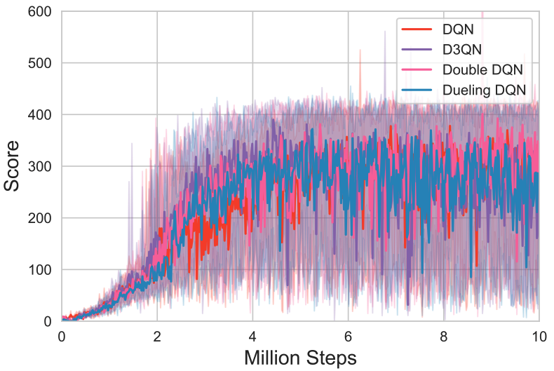
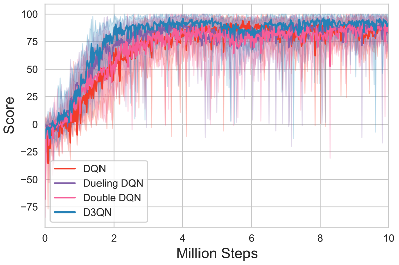
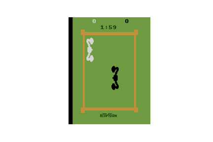
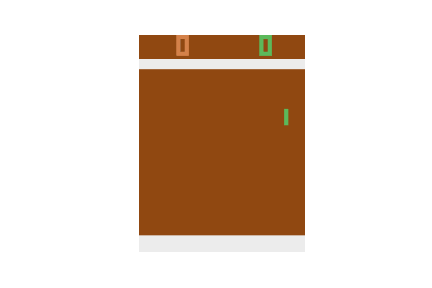
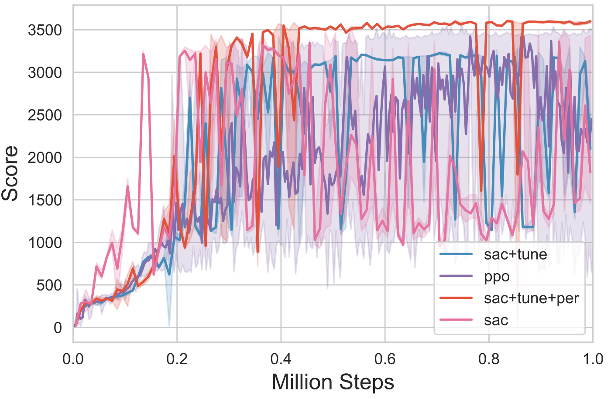
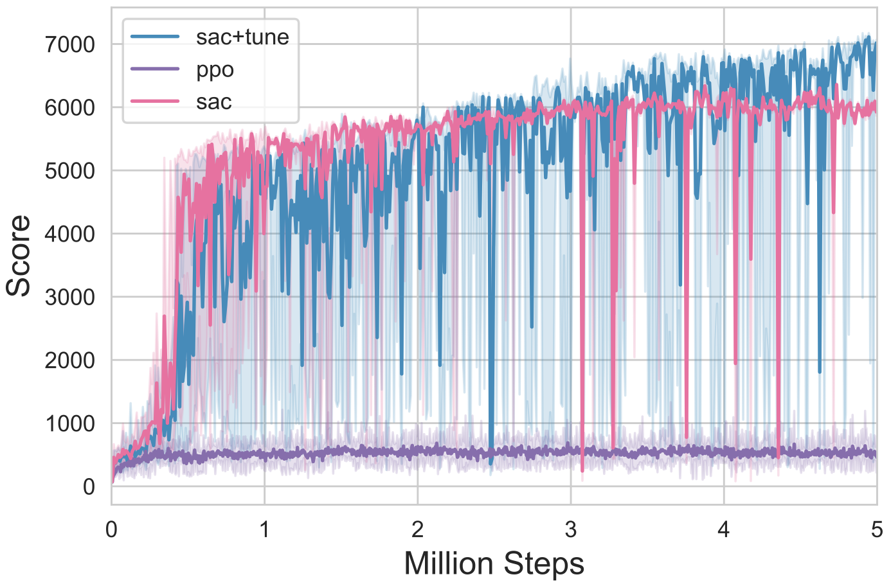
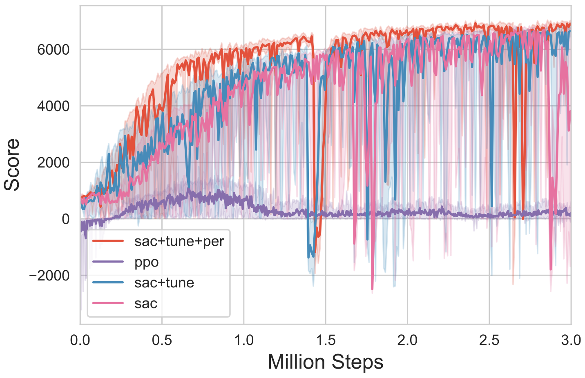
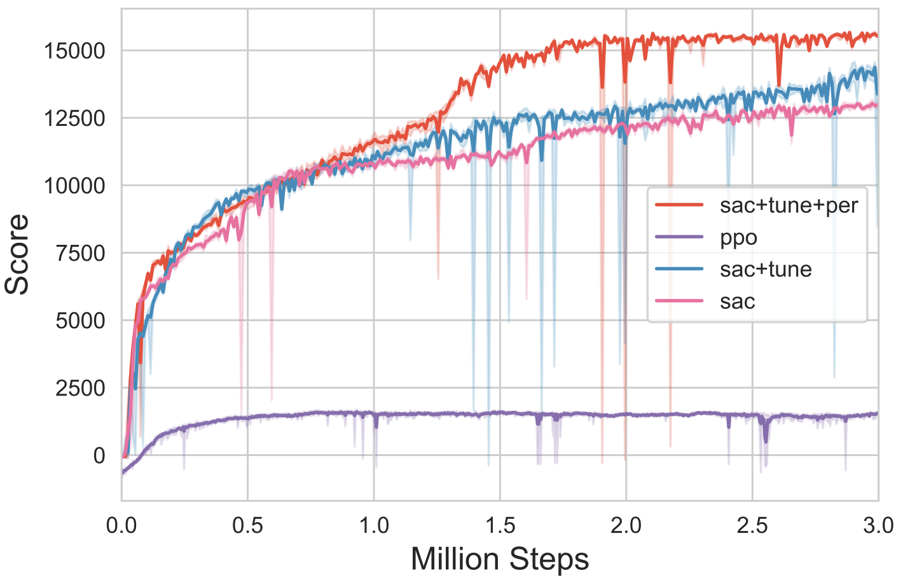

# CS489-proj: Model free control on Atari and MuJoCo.
Course Project for CS489: Reinforcement Learning. 

Spefically, we implement 4 value based algorithms: DQN, Dueling DQN, Double DQN and D3QN and test them on 3 of Gym Atari environments: Breakout, Boxing, and Pong. Besides, we implement 4 policy based algorithms: PPO, SAC (fixed $\alpha$), SAC (learnable $\alpha$), and SAC (learnable $\alpha$)+PER and test them on 4 of Gym MuJoCo environments: Hopper, Humanoid, Ant, HalfCheetah.

## Environment

We implement all our models with Python 3.8, Pytorch 1.8 and Gym 0.24.0. Besides, we need to install `opencv-python` and `atari-py` packages for value-based algorithms, and `mujoco-py` for policy-based algorithms. All of our experiments are run on a NVIDIA RTX 3090. Our OS platform is Linux 20.04.

## Run code

To have an overview of our file structure:

```shell
.
├── LICENSE 
├── README.md # this file
├── atari # value-based algorithms
│   ├── atari_wrappers.py
│   ├── models.py
│   ├── test.py
│   └── train.py
├── mujoco # policy-based algorithms
│   ├── agent.py
│   ├── models.py
│   ├── test.py
│   ├── train.py
│   └── utils.py
├── results # some experimental results
│   ├── ...
├── run.py # to train the RL agent
└── test.py # to test/render the trained agent 
```

In this folder, use command:

```shell
python run.py --env_name xx (e.g. BreakoutNoFrameskip-v4, Hopper-v2)
```

to train your agent. This command will create a folder `local/{env_name}/{hyperparameter}_{datetime}` under `atari/` or `mujoco/`, depending on your environment type. The running testing rewards and the best checkpoint will be saved in the local folder, which can be used for testing afterwards.

For testing, first create the folder `models/{env_name}` under `atari/` or `mujoco/` and move the trained checkpoint `policy.pth` under it, then use command:

```shell
python test.py --env_name xx (e.g. BreakoutNoFrameskip-v4, Hopper-v2)
```

We do not submit the trained checkpoint due to its large file size. So you need to train and get the checkpoint by yourself before running tests. 

Typically, we only provide the simplest environment chosen operation in this folder, the default value-based algorithm is DQN, and the default policy-based algorithm is SAC (fixed $\alpha$).

To further tune the model types (or hyperparameters), switch into the `atari/` or `mujoco/` folder. Run command:

```shell
python train.py --env_name xx --seed xx (--is_dueling) (--is_double) # under atari/
python train.py --env_name xx --seed xx --method xx (--entropy_tuning) (--is_per) # under mujoco/
```

As we can see, we can choose the environment and seed for reproducibility. Besides, we can optinally turn on `dueling` and `double` mode training for value-based algorithms. For policy-based algorithms, we can choose 'sac' or 'ppo' after `--method`, and use `--entropy_tuning`, `--is_per` to turn on learnable $\alpha$ and prioritized experience replay, respectively.

## Results

We list part of our experimental results here for more intuition. Find more details in the report.

### Atari

The testing reward curves:

<figure class="atari_score">
   
   
   

The simulated results:

<figure class="atari_simulate">
  
  
  
</figure>


 The environments are ordered by Breakout, Boxing, and Pong.

### MuJoCo

The testing reward curves:

<figure class="mujoco_score">
  
  
  
  

The simulatied results:

<figure class="mujoco_simulate">
  
  
  
  

  The environments are ordered by Hopper, Humanoid, Ant, and Halfcheetah.

